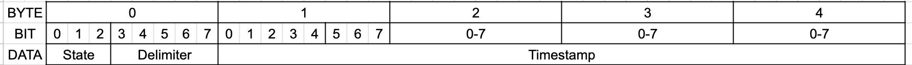

# Timing Test Client

This project is meant to have all different python/jupyter code that captures the serial data from the STM.
This porject does the data analysis and visualization of the timing test.

## Timing test
The most simple test is as follows -
1. A user presses a button.
2. The button causes the solenoid to trigger and shot the launcher.
3. The STM sends data via serial port
4. Test stops automaticlly when the STM 

This test is already implemented in TimingClient.ipynb

## Serial Communication information
The serial communiation is done via a 7 byte packet at a time.
The packet is broken as follows - 
1. 3 MSB of 0th byte - state/stage identifier
2. 5 LSB of 0th byte - 5 MSB of analog value  
3. 5 MSB of 1st byte - 5 LSB of analog value
4. byte 2-5 - timestamp in microseconds from the arduino
5. byte 6 - delimiter


```python
START_TEST        = 0b100
BEFORE_SOLENOID   = 0b001
AFTER_SOLENOID    = 0b010
BEAM_READ         = 0b011 
END_TEST          = 0b110   
```